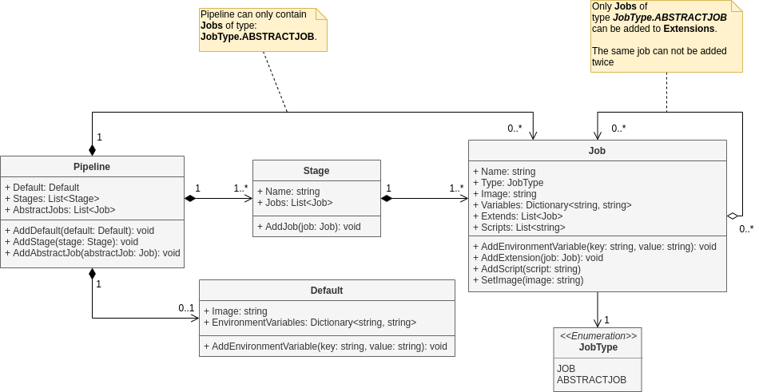

# Internal DSL for Creating GitLab CI/CD Pipelines

## Table of Contents
  - [About the DSL](#about-the-dsl)
  - [Code Structure](#code-structure)
  - [DSL Specification](#dsl-specification)
  - [Using the DSL](#using-the-dsl)
  - [Creating Your Own Pipeline](#creating-your-own-pipeline)
  - [Running The Examples](#running-the-examples)
  - [Example 1 - DotNet Core](#example-1---dotnet-core)
  - [Example 2 - Maven](#example-2---maven)
  - [Example 3 - Inheritance](#example-3---inheritance)
  - [Meta Model Diagram](#Meta-Model-Diagram)


## About the DSL
This DSL is meant to ease the creation of GitLab CI pipelines. This DSL is created in C# and allows for the creation of a vide variety of pipeline configurations.

To use the DSL or run the examples, you need to install DotNet Core SDK.  
The SDK can be found here: [https://dotnet.microsoft.com/download](https://dotnet.microsoft.com/download).

The output of the system is a GitLab CI specification YAML file based on the [GitLab CI Refrence](https://docs.gitlab.com/ee/ci/yaml/).

## Code Structure
The code is structured in the following way:

**Pipelines** - Contains examples of how to use the DSL.  
**GitLab_CI_DSL/metamodel** - Contains the metamodel.  
**GitLab_CI_DSL/builder** - Contains the builder and interface.   
**GitLab_CI_DSL/generator** - Contains the generator which translates the metamodel to an output file.


## DSL Specification
The DSL consists of the following commands:
  - `Create`
    - Finalizes the pipeline creation and returns the meta model instance.
  - `Pipeline`
    - Initializes the pipeline. This must be done first in any pipeline.
  - `Default`
    - Creates a default configuration applied for all jobs in the pipeline.
  - `AbstractJob`
    - Creates an abstract job, that can be inherited from either `Job` or `AbstractJob`.
    - The abstract job can be created both inside and outside a `Stage`. If an abstract job is created inside a stage, it will only be visible to other jobs within that stage.
  - `Stage`
    - Creates a Stage where Jobs and Abstract Jobs can be defined.
    - Jobs created within the same stage will be run in parallel.
    - The jobs within a stage will not start before the previous stage is finished
  - `Job`
    - Creates a job in the current stage. The job defines what to be executed in the pipeline.
    - Jobs can inherit from abstract jobs via the `Extends` command  
  - `Image`
    - Defines the docker image used.
    - `Image` can be set for `Default`, `AbstractJob` and `Job`.
  - `EnvVar`
    - Defines a environment variable.
    - Environment variables will be visible to the jobs where it is defined. Eg. an environment variable defined in default will be available globally.
  - `Script`
    - Defines a command to be executed.
    - `Script` can be defined for abstract jobs and jobs.
  - `Extends`
    - Enables a job or abstract job to inherit: `Image`, `EnVar` and `Scripts` from another abstract job.
    - When extending abstract jobs, the parent configuration will be set first. However these confiurations can be overridden later by other jobs or abstract jobs (see [Example 3](#example-3---inheritance)). 

## Using the DSL
To use the DSL, compile the GitLab_CI_DSL project and include compiled `.dll` in your project.

## Creating Your Own Pipeline
When creating your own pipeline, you create an instance of IPipelineBuilder and are then able to begin the creation.
You must always begin by initializing with a `Pipeline` command and finish with a `Create`.

To generate a GitLab CI pipeline specification, use the `GitLabYmlGenerator` class. This class takes the desired file name, path and a pipeline object and outputs the specification file.

## Running The Examples
The folder `pipelines` contains five example pipelines.

The examples can be run by executing the following command:
```
  dotnet run --project pipelines
```

The example pipelines will be printed in the console if an invalid output path is defined in the different pipelines.
The path can be changed in each of the examples.


## Example 1 - DotNet Core

An instance of the meta model containing two stages and three jobs can be created the following way using abstract jobs, enabling reuse of the Docker image and a script.   

```C#
_pipeline = _builder.
    Pipeline().
        AbstractJob(".Clean").
            Image("mcr.microsoft.com/dotnet/core/sdk").
            Script("dotnet clean").
        Stage("Build").
            Job("Build").
                Extends(".Clean").
                Script("dotnet build").
        Stage("Verify").
            Job("Test").
                Extends(".Clean").
                Script("dotnet test --project GitLab_CI_DSL/").
            Job("Run").
                Extends(".Clean").
                EnvVar("RunVars", "--project Pipelines/").            
                Script("dotnet run $RunVars").
    Create();
```

The pipeline object can then be used to generate the GitLab CI specification. This is done the following way:
```c#
var generator = new GitLabYmlGenerator();

generator.CreateGitlabCiConfig("file.name", "/path/to/output/dir", _pipeline);
```

The output from the code above will look like the specification below:
```yml
stages:
  - Build
  - Verify

Build:
  stage: Build
  image: mcr.microsoft.com/dotnet/core/sdk
  script:
    - dotnet clean
    - dotnet build

Test:
  stage: Verify
  image: mcr.microsoft.com/dotnet/core/sdk
  script:
    - dotnet clean
    - dotnet test --project GitLab_CI_DSL/

Run:
  stage: Verify
  image: mcr.microsoft.com/dotnet/core/sdk
  variables:
    RunVars: "--project Pipelines/"
  script:
    - dotnet clean
    - dotnet run $RunVars
```


## Example 2 - Maven
Pipeline for a Maven project with two jobs.
This pipeline will build and test the code.

This is an example of how abstract jobs can be used to specify a Docker image and a pre script for both jobs.

```c#
_pipeline = _builder.
    Pipeline().
        AbstractJob(".clean").
            Image("maven:latest").
            Script("mvn clean").
        Stage("Build").
            AbstractJob(".compile").
                Extends(".clean").
                Script("mvn compile").
            Job("build").
                Extends(".compile").
                Script("echo \"Compiled Successfully!\"").
        Stage("Test").
            Job("test").
                Extends(".clean").
                Script("mvn verify").
                Script("echo \"Tests passed!\"").
    Create();
```

```c#
var generator = new GitLabYmlGenerator();

generator.CreateGitlabCiConfig("file.name", "/path/to/output/dir", _pipeline);
```

```yml
stages:
  - Build
  - Test

build:
  image: vedsted/maven-jdk8-fx
  stage: Build
  script:
    - mvn clean
    - mvn compile
    - echo "Compiled Successfully!"

test:
  image: vedsted/maven-jdk8-fx
  stage: Test
  script:
    - mvn clean
    - mvn verify
    - echo "Tests passed!"
```

## Example 3 - Inheritance
This is an example to show how a job extending multiple abstract jobs works.

The example shows that an image and environment variable can be inherited and overridden. 
In this case the environment variable `ToPrint` is defined multiple places. The last added has the highest priority. For job `Print` the `ToPrint` variable is set to `abstract 3`.


```c#
_pipeline = _builder.
    Pipeline().  
        AbstractJob(".abs1").
            Image("abstractImage").
            EnvVar("ToPrint", "abstract 1").
        AbstractJob(".abs2").
            Extends(".abs1").
            Image("abstractImage 2").
            EnvVar("ToPrint", "abstract 2").
        AbstractJob(".abs3").
            Image("abstractImage 3").
            EnvVar("ToPrint", "abstract 3").
        Stage("Print").
            Job("Print").
                Extends(".abs2").
                Extends(".abs3").
                Image("JobImage").
                Script("echo $ToPrint").
    Create();
```

The pipeline object can then be given to the generator.
```
var generator = new GitLabYmlGenerator();

generator.CreateGitlabCiConfig("file.name", "/path/to/output/dir", _pipeline);
```

And the output will look like the following:
```yml
stages:
  - Print

Print:
  stage: Print
  image: JobImage
  variables:
    ToPrint: "abstract 3"
  script:
    - echo $ToPrint

```

## Meta Model Diagram
A diagram of the meta model can be seen below:
